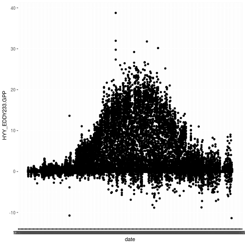

# Introduction

In this session we will outline a basic environmental data workflow. Our goal 
is to highlight common data tasks, and typical ways to solve
them in R. 

We will once again work with data downloaded from SMARTSMEAR, in this
case we will used flux data measured using the eddy covariance
technique at SMEARII research station.

When working with environmental data, there are usually a few steps
that come up each time. These are:
  
* **reading**. Typically data is read from text files, but can also come the
internet as highlighted in our previous session R2-API.ipynb 
* **processing**. The data we read is usually a little 
untidy , for example we may need to subset to correct dates.
* **plotting**. Plotting data is always worth doing as early as
possible. Use histograms or simple line plots as your first steps
in visualising data.  
* **analysis**. This step could indlude performing a statiscial analysis or 
fitting a model.

To do these efficiciently in R is mainly about learning which
functions to use, and how to apply these functions. 

Before we start there is one other thing we should mention.In this
session we will assume that terms like *function*, *argument* are
familiar to you. If they are not then go back to
R1-introduction.ipynb, and check the definition. If you cannot find
the definition in there then complain to your instructors to update
the intro! Alright, let's get started.

 
#1. Reading

We have downloaded our data ahead of
time from SMARTSMEAR and stored it in the /data directory (folder) on
our github:
https://github.com/OptPhotLab/EnvDataSciNotebooks/tree/master/data
(You can inspect the data files by clicking the github link, but this
could slow your computer right down!)

Reading data takes data from storage (typically your computer's hard
disk) and places it somewhere that is can be operated on (RAM). If you
have very large files to read you may notice your computer grind to a
halt, this is because you are filling up your RAM. If this happens you
should think about breaking your analysis down into more manageable
chunks.

There are a few different functions for reading data in R, these include:

* read.csv
* read.table
* read.delim 
* read.csv2 

We can use **help** to inspect our functions, what arguments they
have, and how to set these arguments so that you can read your
data/file in a proper way.

We will use *read.csv* to read in our GPP dataset. 


```r
gpp<-read.csv('../data/gppsmeardata_20160101120000.csv',header = T,sep = ',',dec='.')
```

The double dots **..** in the path tell R to go up a level in the directory (folder) 
heirachy.

Now try to read the Evapotranspirtation data using the same function:


```r
ET<-read.csv('../data/ET smeardata_20160101120000.csv',header = T,sep = ',')
```
It is as simple as that! 

We have read our data into the memory, the next step is
processing. But just before we move on we can use the *head* function to inspect 
the first few lines of our data object:


```r
head(ET)
```

```
##   Year Month Day Hour Minute Second HYY_EDDY233.ET_gapf
## 1 2016     1   1    0      0      0               0.102
## 2 2016     1   1    0     30      0               0.035
## 3 2016     1   1    1      0      0              -0.042
## 4 2016     1   1    1     30      0               0.043
## 5 2016     1   1    2      0      0               0.027
## 6 2016     1   1    2     30      0               0.077
```

can you also remember how to check the type of our objects?


#2. Processing

Before we can make any graphs or perform any stats we usually have to tidy our data
and there are a bunch of techniques in R that can help out with this. Let's 
check out a few of them that make life easier.


##2.1. Combining 

We read in two different data files. We can make life easier by combining
these into a single file. 

Use the *by* argument to set which variables are shared.


```r
gpp.ET<-merge(gpp,ET,by=c("Year","Month","Day","Hour","Minute", "Second"),all = T)
```

#2. Subsetting

Sometimes we are only interested in a particluar section of our data. We can
use *subset* to pull out data by date. 

Subset accepts column names as a second argument. You can use subset to 
extract data for the month of september from *gpp.ET* like this:


```r
gpp.ET.sep <- subset(gpp.ET, Month==9)
```

Can you create a new dataframe containing data measured at midday only? 


```r
gpp.ET.midday <- subset(gpp.ET, Hour==12)
gpp.ET.midday <- subset(gpp.ET.midday, Minute==0)
```

Use head to check the dates are correct:


```r
head(gpp.ET.midday)
```

```
##     Year Month Day Hour Minute Second HYY_EDDY233.GPP HYY_EDDY233.ET_gapf
## 9   2016    10  10   12      0      0          11.820               0.639
## 62  2016    10  11   12      0      0           4.098               0.408
## 80  2016    10   1   12      0      0           8.121               2.375
## 132 2016    10  12   12      0      0           4.399               0.550
## 187 2016    10  13   12      0      0           2.995               0.394
## 237 2016    10  14   12      0      0           4.430               0.507
```

Did you notice something odd? The days are not in ascending order. We can
sort this out using the following (rather complicated!) line:


```r
gpp.ET.midday <- gpp.ET.midday[with(gpp.ET.midday, order(Month, Day)), ]
```

Let's check this has worked out as expected:


```r
head(gpp.ET.midday)
```

```
##       Year Month Day Hour Minute Second HYY_EDDY233.GPP
## 1688  2016     1   1   12      0      0          -0.023
## 17576 2017     1   1   12      0      0           0.459
## 3656  2016     1   2   12      0      0           0.000
## 5552  2016     1   3   12      0      0           0.000
## 5624  2016     1   4   12      0      0           0.000
## 5672  2016     1   5   12      0      0           0.000
##       HYY_EDDY233.ET_gapf
## 1688                0.075
## 17576               0.251
## 3656                0.086
## 5552                0.107
## 5624                0.110
## 5672                0.144
```
BTW my solution to sorting was thanks to Google! You can check out a discussion
of the various sorting options here:
https://stackoverflow.com/questions/1296646/how-to-sort-a-dataframe-by-multiple-columns


Now we have a single dataframe with data at our desired midday timestep we 
can start with our visualisations.


#3. Plotting

##3.1 Line plot
The simplest plot of them all is the dot (or line) plot. The *plot* command is your
friend here!

Let's see what our GPP data looks like:


```r
plot(gpp.ET.midday$HYY_EDDY233.GPP)
```


##3.2 Scatter plot

We can also use *plot* to make scatter plots. You should use the **~** operator
to achieve this e.g. *plot(A~B.Width,data=data.AB)*. Here A and B are our variables
and data.AB is our dataframe that contains our variables. 

Try to make a scatter plot between GPP and ET for our midday data:


```r
plot(HYY_EDDY233.GPP~HYY_EDDY233.ET_gapf, data=gpp.ET.midday)
```


##3.3 histogram

Checking the distribution of your data is usually a very good idea! 
**hist** is used to draw histograms. How is our midday GPP distributed?


```r
hist(gpp.ET.midday$HYY_EDDY233.GPP)
```



##3.4 Panels


#4. Analysis

Our final step is to perform some simple analysis on our data. And because
R is the perhaps the language of choice for stats,the possibilitues for
analyses really are nearly limitless! 

Although we only look at very simple examples here, your own analyses
are likely to be more sophisticated. In this case, it is always a good
idea to search online for analysis packages and code before writing
your own, as someone else has probably faced your issue before.

##4.1. Summary stats

Statisitics are at the heart of R, so let's use some! We can use the *mean*
function on idividual columns. We can even be a bit clever and *sapply* mean 
to a whole dataframe:


```r
col.means <- sapply(gpp.ET.midday, mean, na.rm=TRUE)
print(col.means)
```

```
##                Year               Month                 Day 
##         2016.002725            6.498638           15.716621 
##                Hour              Minute              Second 
##           12.000000            0.000000            0.000000 
##     HYY_EDDY233.GPP HYY_EDDY233.ET_gapf 
##            7.184084            1.548501
```

The *summary* function applies a number of stats over each column. What do we get back 
when we try out summary on our midday data?


```r
summary(gpp.ET.midday)
```

```
##       Year          Month             Day             Hour        Minute 
##  Min.   :2016   Min.   : 1.000   Min.   : 1.00   Min.   :12   Min.   :0  
##  1st Qu.:2016   1st Qu.: 3.500   1st Qu.: 8.00   1st Qu.:12   1st Qu.:0  
##  Median :2016   Median : 7.000   Median :16.00   Median :12   Median :0  
##  Mean   :2016   Mean   : 6.499   Mean   :15.72   Mean   :12   Mean   :0  
##  3rd Qu.:2016   3rd Qu.: 9.500   3rd Qu.:23.00   3rd Qu.:12   3rd Qu.:0  
##  Max.   :2017   Max.   :12.000   Max.   :31.00   Max.   :12   Max.   :0  
##      Second  HYY_EDDY233.GPP  HYY_EDDY233.ET_gapf
##  Min.   :0   Min.   :-3.477   Min.   :-0.490     
##  1st Qu.:0   1st Qu.: 0.783   1st Qu.: 0.319     
##  Median :0   Median : 4.752   Median : 0.758     
##  Mean   :0   Mean   : 7.184   Mean   : 1.549     
##  3rd Qu.:0   3rd Qu.:12.960   3rd Qu.: 2.473     
##  Max.   :0   Max.   :25.119   Max.   : 7.064
```

4.2 Linear models

Fitting models is a very common thing in environmental science, and the straight
line is the most common of them all! To do this in R we use  linear model *lm* function:

Let's try this out between on our midday data between GPP and ET.


```r
model.1<-lm(HYY_EDDY233.GPP~HYY_EDDY233.ET_gapf, data=gpp.ET.midday)
```
*summary* also works on linear model results:

```r
summary(model.1)
```

```
## 
## Call:
## lm(formula = HYY_EDDY233.GPP ~ HYY_EDDY233.ET_gapf, data = gpp.ET.midday)
## 
## Residuals:
##     Min      1Q  Median      3Q     Max 
## -8.9873 -2.1751 -0.4868  1.8571 11.6437 
## 
## Coefficients:
##                     Estimate Std. Error t value Pr(>|t|)    
## (Intercept)           1.2578     0.2496   5.038  7.4e-07 ***
## HYY_EDDY233.ET_gapf   3.8271     0.1124  34.045  < 2e-16 ***
## ---
## Signif. codes:  0 '***' 0.001 '**' 0.01 '*' 0.05 '.' 0.1 ' ' 1
## 
## Residual standard error: 3.428 on 365 degrees of freedom
## Multiple R-squared:  0.7605,	Adjusted R-squared:  0.7599 
## F-statistic:  1159 on 1 and 365 DF,  p-value: < 2.2e-16
```
The *abline* function can be used to plot linear models over scatter plots. Try it 
out, you will need to enter the scatter plot code from section 2 and an 
abline function call.


```r
plot(HYY_EDDY233.GPP~HYY_EDDY233.ET_gapf, data=gpp.ET.midday)
abline(lm(HYY_EDDY233.GPP~HYY_EDDY233.ET_gapf,data=gpp.ET.midday))
```


## A final note on packages

In this notebook we relied soley on built-in functionality. In the 
real world of running scripts on your computer however you should 
make full use of external packages. We will cover some of the most
popular packages in upcoming sessions but for a now a small intro:

A great deal of useful functionality in R is found in external
*packages*.  These are basically collections of code (functions)
written by someone else, and kindly release for our use. Because these
are external to our computer and hosted online, they require
installation (downloading + building in correct location).

When running notebooks in class packages are installed ahead of time, so
the actual installation is hidden from view from the user (you).

However when you are writing scripts to solve your own problems you
may need to install these yourself. For example to install the package
*ggplot2* which can be used for making publication quality plots, you
would type the command *install.packages('ggplot2')*.  This command
then downloads the purr code to your machine, in a location speficied
by R.

Some packages are also hosted on github, for example you can browse
the *purr* source code before you install here:

https://github.com/tidyverse/ggplot2

Thinking to the future, could you imagine your own code being released as a package? 
What would be the benefits of this?


