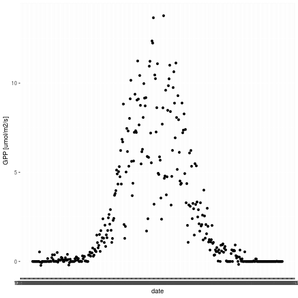
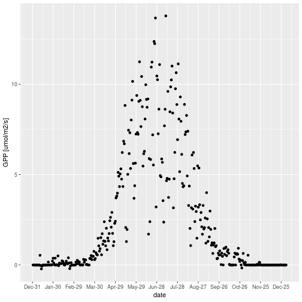
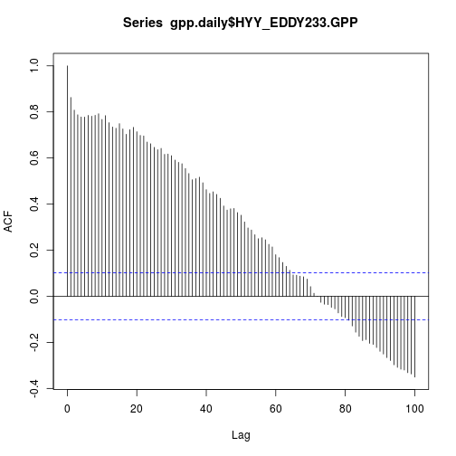
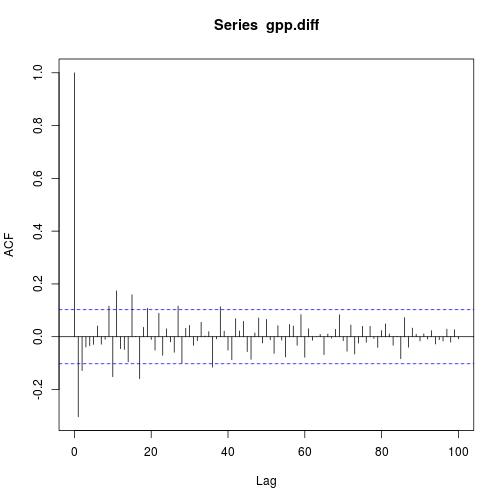

# Introduction

In this session we will tackle the issue of dates and timeseries.

Timeseries are everywhere in environmental data.  At there most basic
timeseries data consist of two columns (vectors) of data. The first is
the date-time column (plotted as X-axis on graph) and the second
column is the variable of interest that changes as a function of time.

The two things we should keep in mind with timeseries data is firstly 
it is easiest to get dates into the correct date-time format as soon as 
possible, this way we can let the computer do the hard work when it comes
to plotting etc. The next thing we should keep in mind is that there are
any number of data analysis and statistical methods specifically designed
for time-series data. There are also caveats related to using standard
statistical techniques (e.g. linear regression) to time-series data, so 
watch out for these! 
   
In this session we will explaine what dates are, show how to read
dates in R, and we will also look at auto-correlation of timeseries,
which are two concepts that are great importantance in timeseries
analysis and find application in a number of different places
(e.g. Durbin Watson statistic, ARIMA models, eddy covariance
calculations etc).

#1. What is a date and datetime exactly?

The simplest representation of dates in R, is the suitably named
*date* object. You can create one of these by converting a character
of correct form e.g.

Use the *as.Date()* function to convert *a.great.date.char* to 
*a.great.R.date*


```r
a.great.char.date <- "2017-10-28"  
typeof(a.great.char.date)
```

```
## [1] "character"
```

```r
print(a.great.char.date)
```

```
## [1] "2017-10-28"
```

```r
a.great.R.date <- as.Date(a.great.char.date)
print(a.great.R.date)
```

```
## [1] "2017-10-28"
```
These variables may look similar, so why don't we just use the character
representation "2017-10-28" rather than the special *date* object?
One example of the usefullness of dates is the fact that we can
perform arithmatic with dates. Try it out; what is the difference between the 
date today *Sys.Date()* and *a.great.R.date*?


```r
time.diff = Sys.Date() - a.great.R.date
print(time.diff)
```

```
## Time difference of 477 days
```

You can also use the *Sys.time()* function to print the current date


```r
Sys.Date()
```

```
## [1] "2019-02-17"
```

We can use a similar function to print out the current time and date


```r
Sys.time()
```

```
## [1] "2019-02-17 18:25:22 EET"
```
This is referred to as a datetime object, and is the main object type
that we will deal with. Datetime objects objects contains date, time
and also specifies the local timezone. We are typically interested in
datetimes, so we will continue with those in this session. However
keep in mind that a simple date object exists if you want to analyse
data on a daily timestep.

Let's inspect a datetime object to find out what we are dealing with:


```r
just.before <- Sys.time()
str(just.before)
```

```
##  POSIXct[1:1], format: "2019-02-17 18:25:22"
```

In R, datetimes are either categorised as *POSIXct* or *POSIXlt*,
which are the different methods R uses to store the information. 

Can you convert *just.before* from *POSIXct* to a *POSIXlt*?:


```r
just.before.lt <- as.POSIXlt(just.before)
str(just.before.lt)
```

```
##  POSIXlt[1:1], format: "2019-02-17 18:25:22"
```

So what's the difference then? 

POSIXlt stores dates as lists (remember those?). Whereas POSIXct
stores dates as the number of seconds that have elapsed since a
particular date (1 January 1970, which you can read
all about here [the unix Epoch](https://en.wikipedia.org/wiki/Unix_time)).

So when to use which? In all honesty I am not 100% sure. However as
POSIXct takes less memory and is somewhat simpler then perhaps that
is the preferred option. Probably the answer will depend on which 
ever is the preferred format of the package you are using, because
as we now know, packages make life easy...


#2. Reading dates from files the easy way, use *lubridate* package.

## read data (See Chao's script)

We have used this data before! GPP is an estimate of CO2 exchange
of tree canopies:

```r
gpp<-read.csv('../data/gppsmeardata_20160101120000.csv',header = T,sep = ',',dec='.')

head(gpp)
```

```
##   Year Month Day Hour Minute Second HYY_EDDY233.GPP
## 1 2016     1   1    0      0      0           0.430
## 2 2016     1   1    0     30      0           0.318
## 3 2016     1   1    1      0      0          -0.219
## 4 2016     1   1    1     30      0           0.220
## 5 2016     1   1    2      0      0           0.123
## 6 2016     1   1    2     30      0           0.478
```
Our task is to take the various columns of date and time information and
convert these to a vector of type *datetime*. Let's go step by step,
we will start with a new character vector of date:


```r
date.char<-paste(gpp$Year,gpp$Month,gpp$Day,sep = '-')
```

do the same for time, but this time set the *sep* argument to *:*:


```r
time.char<-paste(gpp$Hour,gpp$Minute,gpp$Second,sep = ':')
```
combine the two, and convert to POSIXc datetime:

```r
gpp$datetime<-as.POSIXct(paste(date.char,time.char,sep = ' '))
```
we can also add the date as a seperate column, which will be useful
for plotting later on:


```r
gpp$date<-as.Date(date.char)
head(gpp$date)
```

```
## [1] "2016-01-01" "2016-01-01" "2016-01-01" "2016-01-01" "2016-01-01"
## [6] "2016-01-01"
```

To make our life easier in the following selection we will use data
measured at midday only. We can select this using our non-datetime
columns:


```r
gpp.midday <- subset(gpp, Hour==12)
gpp.midday <- subset(gpp.midday, Minute==0) 
```

Remember to stick to the midday data in the following sections...

## Possibly Lubridate

## plot a timeseries

#3. Does data remember? 

A key apect of analysing time-series data is understanding and dealing
with history (or memory). History in the context of time-series refers
to how current values (or future values) depend on past values. This
is seen as trends in behaviour over time, and referred to as
*non-stationary* in math jargon. Likewise *stationary* data has no
trend, and both the mean and variabilty (variance) remains constant
during the time-series.  

Is our GPP data stationary or non-stationary? Let's graph it and find out.

When we graph time-series data, we can use the *scales* package to make
our life easier.

```r
library(ggplot2)
library(scales) 
```
We then use the *scale_x_date* function from scales to format the
x-axis in 1 day time steps :


```r
ggplot(gpp.midday,aes(x=date,y=HYY_EDDY233.GPP))+
  geom_point()+ ylab("GPP [umol/m2/s]") +
  scale_x_date(breaks = date_breaks('1 day'),
               labels = date_format("%m-%d"))
```



It is impossible to read the x-axis here, so let's increase the time-step
to more days, you can also change the *date_format argument* to 
*%b-%d* as well if you like:


```r
ggplot(gpp.midday,aes(x=date,y=HYY_EDDY233.GPP))+
  geom_point() +  ylab("GPP [umol/m2/s]") +
  scale_x_date(breaks = date_breaks('30 day'),
               labels = date_format("%b-%d")) 
```



We have a clear seasonal pattern here, so our data is not stationary.

Once we identify history in our data then we can start to do
interesting things; we might attempt to remove the dependence (by
differencing) or we could attempt to model the history using
*autoregressive* techniques.

## what is autocorrelation?

**Autocorrelation** is a method to quantify time-series history. In
simple terms autocorrelation is the correlation between a variable and
itself shifted in time. The shift in time is referred to as the
*lag*. Typically we compute autocorrelation for a whole range of lags,
and then plot the output as an **autocorrelation function**, which is
a plot of lag Vs correlation value. Confused? well let's walk through
a manual example using our GPP data.


Lagging a variable simple shifts it in time. We can do that for
our GPP data here and plot against the original time-series
(which is shortened to the same length). Let's lag by 30 days and
plot the output:


```r
lag <- 30
n <- length(gpp.midday$HYY_EDDY233.GPP)
gpp.lag <- gpp.midday$HYY_EDDY233.GPP[1:(n-lag)]
gpp.short <- gpp.midday$HYY_EDDY233.GPP[(1+lag):n]  
date.short <-  as.Date(gpp.midday$datetime[(1+lag):n]  )

df.lag <- data.frame(date.short,gpp.lag,gpp.short)

ggplot() + 
  geom_line(data = df.lag, aes(x = date.short, 
  y = gpp.short), color = "red") +		 
  geom_line(data = df.lag, aes(x = date.short,
   y = gpp.lag), color = "blue") + 
   ylab("GPP [umol/m2/s]") +
  scale_x_date(breaks = date_breaks('30 day'),
               labels = date_format("%b-%d")) 
```


Autocorrelation is simply the correlation between these two variables
(the timeseries and its lagged version). The following function *lags*
data and works out the correlation:


```r
lag.corr <- function(ts, lag){
  a <- ts-mean(ts) 	 
  n <- length(a)
  b <- a[1:(n-lag)]
  c <- a[(1+lag):n]  
  # this line is similar to cor function	
  sum(b * c)/sum(a^2)
}
```
note that we do not use the simple *cor* function on our lagged data
to work out correlation, because the strict definition means that we
use this alternative method instead. Click
[here](https://stackoverflow.com/questions/32569322/apparent-error-in-r-acf-calculation/32570260#32570260)
to find out about the differences and see where the function came
from.

What's the GPP autocorrelation at 30 days?


```r
lag.corr(gpp.midday$HYY_EDDY233.GPP,30)
```

```
## [1] 0.6111566
```

How about lag=0? 


```r
lag.corr(gpp.midday$HYY_EDDY233.GPP,0)
```

```
## [1] 1
```

that is equivalent to calculating the correlation of a time-series with
itself!

There is no need to do compute all lag values manually, we can use the
function *acf( )* to automatically graph the 
autocorrelation function, just set the *lag.max* parameter to 
sensible value (maximum number of days),try it out on the midday *gpp* data:


```r
z<-acf(gpp.midday$HYY_EDDY233.GPP,lag.max=100)
```



You can see that for a whole bunch of lag values then we have significant
correlation, this means (as is somewhat obvious) that our data shows
autocorrelation i.e. trends over time.

Let's double check our manual calculation:


```r
lag.corr(gpp.midday$HYY_EDDY233.GPP,25)
```

```
## [1] 0.6798987
```

```r
z[25]
```

```
## 
## Autocorrelations of series 'gpp.midday$HYY_EDDY233.GPP', by lag
## 
##   25 
## 0.68
```

# Putting our new knowledge to work: cross correlation.

What we have done so far is a little theoretical, how can
we use this information to learn something about our data? For 
that we need a theory...

In the boreal regions we think that (air) temperature is really a key
variable that preceeds GPP seasonality. Therefore it is reasonable
to assume that GPP lags temperature by some number of days. 
Can we show this? Can we even work out an estimate of the lag? 

Let's load some temperature data:


```r
T168<-read.csv('../data/T168_20160101120000.csv',header = T,sep = ',',dec='.')

head(T168)
```

```
##   Year Month Day Hour Minute Second HYY_META.T168
## 1 2016     1   1    0      0      0     -6.527667
## 2 2016     1   1    0     30      0     -6.520333
## 3 2016     1   1    1      0      0     -6.594666
## 4 2016     1   1    1     30      0     -6.551667
## 5 2016     1   1    2      0      0     -6.366000
## 6 2016     1   1    2     30      0     -6.122000
```

Extract midday values, like our GPP:


```r
T168.midday <- subset(T168, Hour==12)
T168.midday <- subset(T168.midday, Minute==0) 
```

When we plot GPP and temperature together, what do we see?


```r
gpp.midday$HYY_META.T168 <- T168.midday$HYY_META.T168

ggplot() + 
  geom_line(data = gpp.midday, aes(x = date, 
  y = HYY_EDDY233.GPP), color = "red") +		 
  geom_line(data = gpp.midday, aes(x = date,
   y = HYY_META.T168), color = "blue") + 
   
  scale_x_date(breaks = date_breaks('30 day'),
               labels = date_format("%b-%d")) 
```




Now here comes the new bit, where we apply *cross-correlation*. 
Cross-correlation is just like auto-correlation, only we calculate
lags between two *different* variables, at differing lags. This
allows us to estimate the lag at which maximum correlation occurs. 

Let's try out the R built in *ccf()*, first we have to remove interpolate
a few missing values in T168 as ccf does not like these. We can use
zoo package to fill in missing values:


```r
library(zoo)
```

```
## 
## Attaching package: 'zoo'
```

```
## The following objects are masked from 'package:base':
## 
##     as.Date, as.Date.numeric
```

```r
gpp.midday$HYY_META.T168i <- na.approx(gpp.midday$HYY_META.T168)

sum(is.na(gpp.midday$HYY_META.T168))
```

```
## [1] 5
```

```r
sum(is.na(gpp.midday$HYY_META.T168i))
```

```
## [1] 0
```

Finally, time to try out the ccf and find out if GPP lags temperature:


```r
ccf(gpp.midday$HYY_EDDY233.GPP,gpp.midday$HYY_META.T168i,lag.max=40)
```


The positive lag shows that GPP does indeed follow temperature. 
Although in the maximum correlation occurs at only 2 days. I think
we would have to do a little more processing to see how many days
GPP truly follows T by!


# Differencing a timeseries and Autocorrelation

Differencing a time-series is a technique that removes history i.e.
attempts to make a time-series stationary. It is a simple idea, we
just take the difference between adjacent values. We use the *diff*
function in R to do this. Try it out below:


```r
gpp.diff <- diff(gpp.midday$HYY_EDDY233.GPP)
```
Note that the length of gpp.diff is one less than the the length
of the original GPP time-series. Let's add a NA so we can fit
it into the original dataframe, and plot the output:


```r
gpp.midday$gpp.diff <- c(gpp.diff, NA)

ggplot(gpp.midday,aes(x=date,y=gpp.diff))+
  geom_point() +  ylab("GPP difference") +
  scale_x_date(breaks = date_breaks('30 day'),
               labels = date_format("%b-%d")) 
```

```
## Warning: Removed 1 rows containing missing values (geom_point).
```


let's see what the acf 
plot looks like (note that we have to use the gpp.diff variable here
not the dataframe, as acf fails for vectors with NA):


```r
acf(gpp.diff,lag.max=100)
```


The rapid fall-off in the acf means that our data no longer remembers
so much of its history. 

So is the difference time-series stationary? well the mean stays constant, 
but the variabilty (variance) is still a funcion of time. So we cannot
say that our time-series is stationary in variance. 

