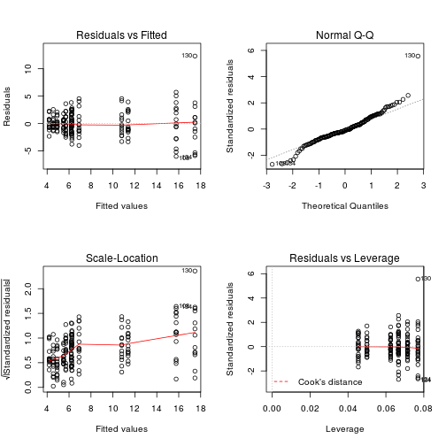
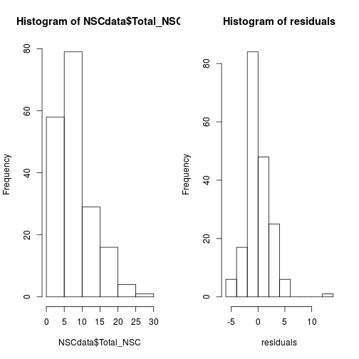
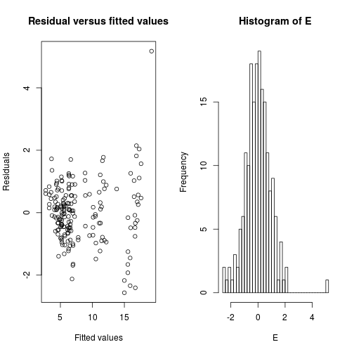

## what is model selection

It is choosing the simplest model that adequately explain the data


Here we are not going to be able to go through all the theory behind it and cover everything into details. However, I will provide you with a reliable method to do it. If you are interested to go further, we can discuss.

# to do before we get started


```r
NSCdata0<-read.csv("../data/NSCdata2.csv",header=T,se=",")
str(NSCdata0)
```

```
## 'data.frame':	207 obs. of  9 variables:
##  $ Season        : Factor w/ 3 levels "Fall","Spring",..: 1 1 1 1 1 1 1 1 1 1 ...
##  $ Tree          : int  364 364 364 364 364 364 542 542 542 542 ...
##  $ Part          : Factor w/ 2 levels "L","R": 1 2 2 1 2 2 1 2 1 2 ...
##  $ Health        : Factor w/ 2 levels "D","ND": 1 1 1 1 1 1 1 1 1 1 ...
##  $ Total_NSC     : num  6.19 8.87 NA 4 7.86 8.77 4.39 2.49 4.47 8.66 ...
##  $ Starch        : num  1.34 2.31 NA 1.05 1.93 0.3 0.52 0.26 0.93 1.16 ...
##  $ Sucrose       : num  0.99 1.08 NA 0.48 0.9 1.37 0.84 0.5 0.49 1.37 ...
##  $ Gluc_Fruc     : num  3.86 5.47 NA 2.46 5.03 7.11 3.02 1.73 3.05 6.13 ...
##  $ Soluble_Sugars: num  4.85 6.55 NA 2.94 5.93 8.48 3.87 2.23 3.54 7.5 ...
```

```r
NSCdata<-subset(NSCdata0,!NSCdata0$Health=="?")
str(NSCdata)
```

```
## 'data.frame':	207 obs. of  9 variables:
##  $ Season        : Factor w/ 3 levels "Fall","Spring",..: 1 1 1 1 1 1 1 1 1 1 ...
##  $ Tree          : int  364 364 364 364 364 364 542 542 542 542 ...
##  $ Part          : Factor w/ 2 levels "L","R": 1 2 2 1 2 2 1 2 1 2 ...
##  $ Health        : Factor w/ 2 levels "D","ND": 1 1 1 1 1 1 1 1 1 1 ...
##  $ Total_NSC     : num  6.19 8.87 NA 4 7.86 8.77 4.39 2.49 4.47 8.66 ...
##  $ Starch        : num  1.34 2.31 NA 1.05 1.93 0.3 0.52 0.26 0.93 1.16 ...
##  $ Sucrose       : num  0.99 1.08 NA 0.48 0.9 1.37 0.84 0.5 0.49 1.37 ...
##  $ Gluc_Fruc     : num  3.86 5.47 NA 2.46 5.03 7.11 3.02 1.73 3.05 6.13 ...
##  $ Soluble_Sugars: num  4.85 6.55 NA 2.94 5.93 8.48 3.87 2.23 3.54 7.5 ...
```

```r
library(nlme)
library(MASS)
```
This is a subset of a real dataset published some time ago (Salmon et al. 2015 PCE).
This present non-structural carbohydrates (Total, Starch, Sucrose, Glucose and Fructose, and total soluble sugars) in Pinus sylvestris trees in a spanish population.
The data are group into:
- Season
- sampled tissue: needles (L) or twing (R)
- Health status: Defoliated (D) means dying, Non-defoliated (ND) means healthy
Measurments were done on the same trees repeatedly

## fixed effect model (ANOVA, Linear model)

I assume most of you are familiar with those types of model. Thus this is mostly to refresh memories and get you thinking about the model selection.
If that's not the case, let me know

#ANOVA

Now for the sake of testing, image all measurements are independent.
We can look at the effect of Season, Part and Health on total NSC with a classical ANOVA

Do you have an idea how to code it? Or at least structure it?
Give it a try


Note that there are different ways to code for an ANOVA in R,

```r
anova1<-aov(Total_NSC~Season*Part*Health,data=NSCdata)
summary(anova1)
```

```
##                     Df Sum Sq Mean Sq F value   Pr(>F)    
## Season               2 2670.0  1335.0 251.334  < 2e-16 ***
## Part                 1   17.5    17.5   3.287   0.0716 .  
## Health               1    6.8     6.8   1.275   0.2605    
## Season:Part          2  473.7   236.9  44.592 2.23e-16 ***
## Season:Health        2   10.1     5.0   0.947   0.3900    
## Part:Health          1    1.6     1.6   0.305   0.5815    
## Season:Part:Health   2   18.7     9.3   1.758   0.1754    
## Residuals          175  929.5     5.3                     
## ---
## Signif. codes:  0 '***' 0.001 '**' 0.01 '*' 0.05 '.' 0.1 ' ' 1
## 20 observations deleted due to missingness
```

How to check if the model is ok?


```r
par(mfrow=c(2,2));plot(anova1)
```


Let's look at the residual

```r
residuals <- residuals(anova1)
par(mfrow=c(1,2))
hist(NSCdata$Total_NSC,breaks=8)   # Breaks only suggestion
hist(residuals,breaks=8)
```




Now, can we simplify the model?
How would you do it?


#linear regression

Now, let's try to see if there is a relation betweem continous variable.
For example, does the amount of starch and soluble sugars are related?


```r
lm1<-lm(Starch~Soluble_Sugars,data=NSCdata)
summary(lm1)
```

```
## 
## Call:
## lm(formula = Starch ~ Soluble_Sugars, data = NSCdata)
## 
## Residuals:
##    Min     1Q Median     3Q    Max 
## -4.759 -3.079 -2.096  1.972 21.997 
## 
## Coefficients:
##                Estimate Std. Error t value Pr(>|t|)    
## (Intercept)      5.8460     1.1305   5.171    6e-07 ***
## Soluble_Sugars  -0.5396     0.2240  -2.409    0.017 *  
## ---
## Signif. codes:  0 '***' 0.001 '**' 0.01 '*' 0.05 '.' 0.1 ' ' 1
## 
## Residual standard error: 4.671 on 185 degrees of freedom
##   (20 observations deleted due to missingness)
## Multiple R-squared:  0.03042,	Adjusted R-squared:  0.02518 
## F-statistic: 5.805 on 1 and 185 DF,  p-value: 0.01696
```
now if you account for other factors

```r
lm2<-lm(Starch~Soluble_Sugars*Season*Part*Health,data=NSCdata)
summary(lm2)
```

```
## 
## Call:
## lm(formula = Starch ~ Soluble_Sugars * Season * Part * Health, 
##     data = NSCdata)
## 
## Residuals:
##     Min      1Q  Median      3Q     Max 
## -5.8733 -0.3776 -0.0265  0.2873 10.2209 
## 
## Coefficients:
##                                            Estimate Std. Error t value
## (Intercept)                                 0.30418    1.90751   0.159
## Soluble_Sugars                              0.10732    0.48386   0.222
## SeasonSpring                                4.24712    3.78491   1.122
## SeasonSummer                                0.20763    2.76039   0.075
## PartR                                       0.17024    2.22170   0.077
## HealthND                                   -0.20968    2.75787  -0.076
## Soluble_Sugars:SeasonSpring                 1.62043    0.92505   1.752
## Soluble_Sugars:SeasonSummer                -0.09858    0.65881  -0.150
## Soluble_Sugars:PartR                       -0.03589    0.52386  -0.069
## SeasonSpring:PartR                         -0.61475    4.84785  -0.127
## SeasonSummer:PartR                         -0.14929    3.25788  -0.046
## Soluble_Sugars:HealthND                     0.05147    0.73230   0.070
## SeasonSpring:HealthND                      -6.76151    5.58539  -1.211
## SeasonSummer:HealthND                       0.07609    4.25291   0.018
## PartR:HealthND                              0.64584    3.28591   0.197
## Soluble_Sugars:SeasonSpring:PartR          -1.19079    1.10599  -1.077
## Soluble_Sugars:SeasonSummer:PartR           0.02831    0.72913   0.039
## Soluble_Sugars:SeasonSpring:HealthND        2.39702    1.42013   1.688
## Soluble_Sugars:SeasonSummer:HealthND       -0.03907    0.99334  -0.039
## Soluble_Sugars:PartR:HealthND              -0.19358    0.79422  -0.244
## SeasonSpring:PartR:HealthND                 0.41819    7.09824   0.059
## SeasonSummer:PartR:HealthND                -0.47517    4.95251  -0.096
## Soluble_Sugars:SeasonSpring:PartR:HealthND -1.16637    1.66506  -0.700
## Soluble_Sugars:SeasonSummer:PartR:HealthND  0.17068    1.08247   0.158
##                                            Pr(>|t|)  
## (Intercept)                                  0.8735  
## Soluble_Sugars                               0.8247  
## SeasonSpring                                 0.2635  
## SeasonSummer                                 0.9401  
## PartR                                        0.9390  
## HealthND                                     0.9395  
## Soluble_Sugars:SeasonSpring                  0.0817 .
## Soluble_Sugars:SeasonSummer                  0.8812  
## Soluble_Sugars:PartR                         0.9455  
## SeasonSpring:PartR                           0.8992  
## SeasonSummer:PartR                           0.9635  
## Soluble_Sugars:HealthND                      0.9441  
## SeasonSpring:HealthND                        0.2278  
## SeasonSummer:HealthND                        0.9857  
## PartR:HealthND                               0.8444  
## Soluble_Sugars:SeasonSpring:PartR            0.2832  
## Soluble_Sugars:SeasonSummer:PartR            0.9691  
## Soluble_Sugars:SeasonSpring:HealthND         0.0933 .
## Soluble_Sugars:SeasonSummer:HealthND         0.9687  
## Soluble_Sugars:PartR:HealthND                0.8077  
## SeasonSpring:PartR:HealthND                  0.9531  
## SeasonSummer:PartR:HealthND                  0.9237  
## Soluble_Sugars:SeasonSpring:PartR:HealthND   0.4846  
## Soluble_Sugars:SeasonSummer:PartR:HealthND   0.8749  
## ---
## Signif. codes:  0 '***' 0.001 '**' 0.01 '*' 0.05 '.' 0.1 ' ' 1
## 
## Residual standard error: 1.645 on 163 degrees of freedom
##   (20 observations deleted due to missingness)
## Multiple R-squared:  0.8941,	Adjusted R-squared:  0.8792 
## F-statistic: 59.84 on 23 and 163 DF,  p-value: < 2.2e-16
```
Do you know what are the Multiple R-square and Adjusted R-square

Multiple R squared simply measure of Rsquared for the model: i.e.,  the amount of variation in the response variable that can be explained by the independent variables. It alwasy increase with the increasing number of variables used in the model.T

Adjusted Rsquared controls against this increase, and adds penalties for the number of predictors in the model. Therefore it shows a balance between the most parsimonious model, and the best fitting model. 

Big difference can be an sign of overfitting.

Think when you want to consider each one of them

What would you do to simplify the above complex model? How would you text it?


## mixed effect models or additive mixed effect model

Now we know that those measurments were actually repeatidly made on the same trees, so we should account for that in the models.

Note that there are different ways to do mixed-effect model in R. We will go with the package "nlme"


This is mostly based on Zuur et al. 2009 - mixed effects models and extension in ecology with R
That's a great stat book and they details things a lot more, but this should be enough to get you going.

Model selection is based on:
1)Akaike Information Criteria (AIC), or the Bayesian Information Criteria (BIC).
Both measure the fit of the models and give a penality for its complexity. The simpler the model (that explain the data as well) the better

2)

Two types of approaches: top-down (starting from the full model and trying to simplify it) and step-up (the opposite). Top-down is usually recommended.
 

1. Start with a model where the fixed component contains all explanatory variables and as many interactions as possible (the beyond optimal model). 

gls only deals with heterogenity of the variance
lme deals with real random terms (for example here it account for the nesting/repeating of the measurements on trees)
The random term (here the tree) can influence only the intercept of the regression (model2) or the slope as well (model3, 4, 5 and 6)


```r
NSCdata1<-na.omit(NSCdata)

mix1<-gls(Total_NSC~Season*Part*Health,data=NSCdata1,method="REML")
mix2<-lme(Total_NSC~Season*Part*Health,random=~1|Tree,data=NSCdata1,method="REML")
#mix3<-lme(Total_NSC~Season*Part*Health,random=~1+Season|Tree,data=NSCdata1 ,method="REML") #there is a problem with that model (you can remove the # to see it). Because, it doesn't matter here for the model selection process with will just ignore it for now
mix4<-lme(Total_NSC~Season*Part*Health,random=~1+Health|Tree,data=NSCdata1 ,method="REML")
mix5<-lme(Total_NSC~Season*Part*Health,random=~1+Part|Tree,data=NSCdata1 ,method="REML")
mix6<-lme(Total_NSC~Season*Part*Health,random=~1+Part+Health|Tree,data=NSCdata1 ,method="REML")
```

2. Using the beyond optimal model, find the optimal structure of the random component. 

This can be done by looking at the model with the lowest AIC


```r
AIC(mix1,mix2,mix4,mix5,mix6)
```

```
##      df      AIC
## mix1 13 847.6616
## mix2 14 825.6359
## mix4 16 829.1925
## mix5 16 829.3313
## mix6 19 834.8313
```

```r
#BIC(mix1,mix2,mix4,mix5,mix6)
```

Here model 2, the mixed effect model where the random term only impact the intercept, is best.

```r
summary(mix2)
```

```
## Linear mixed-effects model fit by REML
##  Data: NSCdata1 
##        AIC      BIC   logLik
##   825.6359 869.9429 -398.818
## 
## Random effects:
##  Formula: ~1 | Tree
##         (Intercept) Residual
## StdDev:    1.187763 2.022967
## 
## Fixed effects: Total_NSC ~ Season * Part * Health 
##                                 Value Std.Error  DF   t-value p-value
## (Intercept)                  4.523383 0.6710018 162  6.741239  0.0000
## SeasonSpring                11.249651 0.7404047 162 15.193921  0.0000
## SeasonSummer                 0.394742 0.7277846 162  0.542388  0.5883
## PartR                        1.817081 0.6791108 162  2.675676  0.0082
## HealthND                    -0.333383 0.9716469  13 -0.343111  0.7370
## SeasonSpring:PartR          -6.193747 1.0034163 162 -6.172660  0.0000
## SeasonSummer:PartR          -1.033956 0.9862763 162 -1.048343  0.2960
## SeasonSpring:HealthND        2.229068 1.0755887 162  2.072417  0.0398
## SeasonSummer:HealthND        0.918830 1.0556034 162  0.870431  0.3854
## PartR:HealthND               0.285561 0.9804912 162  0.291243  0.7712
## SeasonSpring:PartR:HealthND -2.585048 1.4617166 162 -1.768501  0.0789
## SeasonSummer:PartR:HealthND  0.336314 1.4344130 162  0.234461  0.8149
##  Correlation: 
##                             (Intr) SsnSpr SsnSmm PartR  HlthND SsnSp:PR
## SeasonSpring                -0.552                                     
## SeasonSummer                -0.561  0.509                              
## PartR                       -0.602  0.545  0.555                       
## HealthND                    -0.691  0.381  0.387  0.415                
## SeasonSpring:PartR           0.407 -0.736 -0.375 -0.677 -0.281         
## SeasonSummer:PartR           0.414 -0.375 -0.738 -0.689 -0.286  0.466  
## SeasonSpring:HealthND        0.380 -0.688 -0.350 -0.375 -0.542  0.507  
## SeasonSummer:HealthND        0.387 -0.351 -0.689 -0.382 -0.552  0.259  
## PartR:HealthND               0.417 -0.377 -0.384 -0.693 -0.595  0.469  
## SeasonSpring:PartR:HealthND -0.279  0.505  0.258  0.465  0.399 -0.686  
## SeasonSummer:PartR:HealthND -0.285  0.258  0.508  0.473  0.406 -0.320  
##                             SsnSm:PR SsnSp:HND SsnSm:HND PR:HND
## SeasonSpring                                                   
## SeasonSummer                                                   
## PartR                                                          
## HealthND                                                       
## SeasonSpring:PartR                                             
## SeasonSummer:PartR                                             
## SeasonSpring:HealthND        0.258                             
## SeasonSummer:HealthND        0.509    0.499                    
## PartR:HealthND               0.477    0.538     0.547          
## SeasonSpring:PartR:HealthND -0.320   -0.735    -0.367    -0.671
## SeasonSummer:PartR:HealthND -0.688   -0.368    -0.736    -0.684
##                             SsnSp:PR:HND
## SeasonSpring                            
## SeasonSummer                            
## PartR                                   
## HealthND                                
## SeasonSpring:PartR                      
## SeasonSummer:PartR                      
## SeasonSpring:HealthND                   
## SeasonSummer:HealthND                   
## PartR:HealthND                          
## SeasonSpring:PartR:HealthND             
## SeasonSummer:PartR:HealthND  0.459      
## 
## Standardized Within-Group Residuals:
##         Min          Q1         Med          Q3         Max 
## -2.83651023 -0.51047321  0.01071716  0.59738712  4.77908574 
## 
## Number of Observations: 187
## Number of Groups: 15
```

```r
anova(mix2)
```

```
##                    numDF denDF  F-value p-value
## (Intercept)            1   162 564.0638  <.0001
## Season                 2   162 329.7784  <.0001
## Part                   1   162   3.7848  0.0535
## Health                 1    13   0.4099  0.5331
## Season:Part            2   162  58.9249  <.0001
## Season:Health          2   162   1.3258  0.2685
## Part:Health            1   162   0.4256  0.5151
## Season:Part:Health     2   162   2.2556  0.1081
```
Do you know the difference between these two output?

3. find the optimal fixed structure. 


```r
sel1<-lme(Total_NSC~Season*Part*Health,random=~1|Tree,data=NSCdata1,method="ML") #note this is the same as mix2 but with ML
sel2<-lme(Total_NSC~(Season+Part+Health)^2,random=~1|Tree,data=NSCdata1,method="ML")
AIC(sel1,sel2)
```

```
##      df      AIC
## sel1 14 834.7133
## sel2 12 835.4369
```

That's a bit of a tricky case. The three way interaction is not significant (see above) and the AIC is almost equal if very slightly higher than the complex model. Ultimately we would prefer a simpler model.
There are a few things that can be considered when deciding how to proceed. One is to look at the residual and model validation (see below 4), another is to see what the BIC tells us


```r
BIC(sel1,sel2)
```

```
##      df      BIC
## sel1 14 879.9488
## sel2 12 874.2102
```
Maybe we can go further, but let's check that our simpler model is not significantly worse than the full model

```r
anova(sel1,sel2)
```

```
##      Model df      AIC      BIC    logLik   Test  L.Ratio p-value
## sel1     1 14 834.7133 879.9488 -403.3566                        
## sel2     2 12 835.4369 874.2102 -405.7185 1 vs 2 4.723634  0.0942
```
That's ok.

Thus, let's decide to see if we can simply the model even further. Can one of the two-way interaction be removed?

```r
sel3a<-lme(Total_NSC~Season+Part+Health+Season:Part+Season:Health,random=~1|Tree,data=NSCdata1,method="ML")
sel3b<-lme(Total_NSC~Season+Part+Health+Season:Part+Part:Health,random=~1|Tree,data=NSCdata1,method="ML")
sel3c<-lme(Total_NSC~Season+Part+Health+Health:Part+Season:Health,random=~1|Tree,data=NSCdata1,method="ML")
AIC(sel2,sel3a,sel3b,sel3c)
```

```
##       df      AIC
## sel2  12 835.4369
## sel3a 11 833.8751
## sel3b 10 833.9416
## sel3c 10 923.0622
```
It seems Part:health is not very important (that can also be seem from the anova(mix2) above)

you can check that to:

```r
#anova(sel1,sel3a)
```


Can we go further?

```r
sel4a<-lme(Total_NSC~Season+Part+Health+Season:Part,random=~1|Tree,data=NSCdata1,method="ML")
sel4b<-lme(Total_NSC~Season+Part+Health+Season:Health,random=~1|Tree,data=NSCdata1,method="ML")
AIC(sel3a,sel4a,sel4b)
```

```
##       df      AIC
## sel3a 11 833.8751
## sel4a  9 832.5748
## sel4b  9 921.2388
```


```r
#anova(sel1,sel4a)
```

(we could do a test to remove the Season:Part interaction but if you look at the AIC of model 3c, 4c and the output of the anova(mix2) it is clear that it matters)

Now we have the following model: Total_NSC~Season+Part+Health+Season:Part
Does the Heatlh actually matter?


```r
sel5<-lme(Total_NSC~Season+Part+Season:Part,random=~1|Tree,data=NSCdata1,method="ML")
AIC(sel4a,sel5)
```

```
##       df      AIC
## sel4a  9 832.5748
## sel5   8 831.0648
```

this suggest that the health status doesn't matter


```r
anova(sel1,sel5)
```

```
##      Model df      AIC      BIC    logLik   Test  L.Ratio p-value
## sel1     1 14 834.7133 879.9488 -403.3566                        
## sel5     2  8 831.0648 856.9137 -407.5324 1 vs 2 8.351522  0.2135
```
So this suggest that we are not doing a worth job at explaining the data with the model:
Total_NSC~Season+Part+Season:Part
than with the model:
Total_NSC~Season+Part+Health+Season:Part+Season:Health+Part:Health+Season:Part:Health

4. Present the final model using REML estimation and test it's validity


```r
Final1<-lme(Total_NSC~Season+Part+Season:Part,random=~1|Tree,data=NSCdata1,method="REML")
summary(Final1)
```

```
## Linear mixed-effects model fit by REML
##  Data: NSCdata1 
##        AIC      BIC    logLik
##   830.5514 856.1394 -407.2757
## 
## Random effects:
##  Formula: ~1 | Tree
##         (Intercept) Residual
## StdDev:    1.148058 2.039393
## 
## Fixed effects: Total_NSC ~ Season + Part + Season:Part 
##                        Value Std.Error  DF    t-value p-value
## (Intercept)         4.356379 0.4812399 167   9.052407  0.0000
## SeasonSpring       12.296432 0.5413250 167  22.715434  0.0000
## SeasonSummer        0.834954 0.5313757 167   1.571306  0.1180
## PartR               1.956876 0.4937806 167   3.963048  0.0001
## SeasonSpring:PartR -7.401162 0.7354587 167 -10.063328  0.0000
## SeasonSummer:PartR -0.883543 0.7218685 167  -1.223967  0.2227
##  Correlation: 
##                    (Intr) SsnSpr SsnSmm PartR  SsnSp:PR
## SeasonSpring       -0.552                              
## SeasonSummer       -0.562  0.500                       
## PartR              -0.605  0.539  0.548                
## SeasonSpring:PartR  0.406 -0.735 -0.368 -0.671         
## SeasonSummer:PartR  0.414 -0.368 -0.736 -0.684  0.459  
## 
## Standardized Within-Group Residuals:
##         Min          Q1         Med          Q3         Max 
## -2.56402980 -0.55231633 -0.01105816  0.55287175  5.17497345 
## 
## Number of Observations: 187
## Number of Groups: 15
```

```r
anova(Final1)
```

```
##             numDF denDF  F-value p-value
## (Intercept)     1   167 593.7956  <.0001
## Season          2   167 324.4176  <.0001
## Part            1   167   3.7324  0.0551
## Season:Part     2   167  57.9501  <.0001
```

Here we presented cases with mixed effect model but the same can be used with additive models


Now you can try the same process of model selection with other NSC variables

```r
E<-resid(Final1,type="normalized")
fit<-fitted(Final1)
op<-par(mfrow=c(1,2))
plot(x=fit, y=E,
     xlab="Fitted values", ylab="Residuals",
     main="Residual versus fitted values")
#identify(fit,E)
hist(E,nclass=30)
```



```r
par(op)
```

Really not too bad (one outlier), even if there is a bit of an increase in the residual vs fitted values. 
It might be that some information are missing in the dataset/model. For example, there might be a temperature effect that is not included here.
That could be handled with data transformation, glm, etc. but that will be for another course.


## special cases

# interaction with more than two variables

There is no clear rule how to handle that. On one hand from a statisitcal method point-of-view you should start with the most complex model and if there is a three-way interaction, you should keep it. On the other hand, I haven't met anyone so far that is able to interpret the meaning of a three (or higher) way interaction. Thus, there might be a very important term, but we cannot make sense of it.

# small sample size

AICc is the AIC corrected for small sample size since there is a risk that AIC will select too complicated model in that case (overfit)
Whn to use it? not set in stone but some author recommnend AICc when N/K<40 with N the number of sample and K the number of variables fitted in the model

```r
library(MuMIn)
```

```
## Error in library(MuMIn): there is no package called 'MuMIn'
```

```r
AIC(sel4a,sel5)
```

```
##       df      AIC
## sel4a  9 832.5748
## sel5   8 831.0648
```

```r
AICc(sel4a,sel5)
```

```
## Error in AICc(sel4a, sel5): could not find function "AICc"
```


# what to do if the variables are not orthogonals

Two variables are othogonal if there is no correlation between them.
That's a complicated, albeit common issue. For example, PAR and VPD or tempearture are often correlated.
The order n which they come n the model then matters.

We will keep it as food for thought at this point, but we could come back to it anther time.
